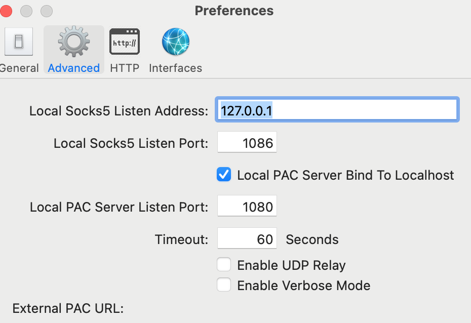
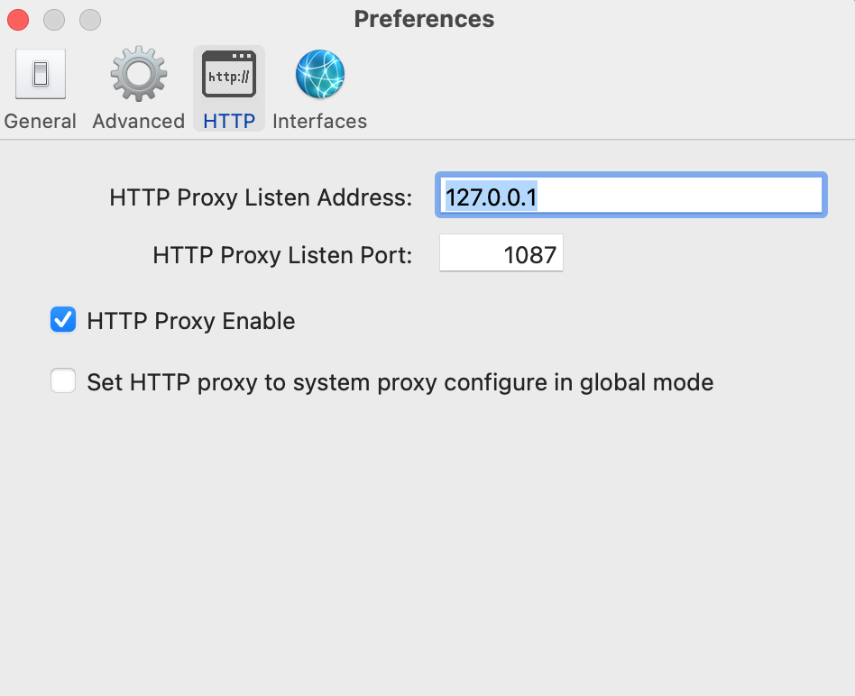

# How to Setup Shadowsocks on Centos Sever and Mac Client?

by Liu Qifeng, 2021.09.19

## 1. Why use Shadowsocks(ss)?

When you are in some special places, you want to access google services like gmail, youtube, or some useful overseas technical webs (if you are a coder). But the access may be blocked by the firewall or some other reasons. One way is to use ss to bypass it. 

Other scenario is you want to protect your privacy, ss would be a good way since it is based on proxy and encryption. 

## 2. Why write down this cookbook?

So far, I don't find any clear and simple cookbook. Some key parameter settings are super ambiguous. Even for the official web of ss, the introduction is too concise to understand. Most related tutorials are out of date. Since it takes me some time to dig out the solution, I believe it would be useful for others. 

## 3. Technical introduction

The flowchart of accessing an overseas web is roughly depicted as follows (It is probably not strictly correct since I am not a networking engineer):
 * In a client like a Mac, the request is captured by Socket5 and then encrypted by the local ss installed on the client.
 * The encrypted request is passed to the firewall and get approved since its destination is already encrypted.  
 * After "cheating" the firewall, the encrypted request approaches the remote overseas server. The ss installed on the server will decrypt it and send normal request to destination web. 
 * The information feedback from the destination will pass through the ss on the server, firewall, the ss on the client, and captured by socket5 and finally rendered by the client explore in the way of proxy. 

## 4. Environment

Here is my actual environment for reference:
* Server:  
A ECS server in Hong Kong.
```
~ cat /etc/centos-release
CentOS Linux release 8.4.2105
~ python3
Python 3.6.8
```

* Client:   
A Mac Pro Laptop.
```
~ sw_vers
ProductName:	macOS
ProductVersion:	11.5.1
BuildVersion:	20G80
~ python
Python 3.8.3
```

## 5. Set up ss on server
* ssh onto the remote server
* sudo dnf install -y epel-release
* sudo dnf update -y
* sudo dnf install -y snapd
* sudo systemctl start snapd.service
* sudo systemctl enable snapd.service
* sudo snap install shadowsocks-libev
* configuration
```
cat /var/snap/shadowsocks-libev/common/server-config.json
{
    "server":["[::0]", "0.0.0.0"],
    "mode":"tcp_and_udp",
    "server_port":8888,
    "local_port":1080,  # I guess the port of client to communicate with the server
    "password":"you password",
    "timeout":60,
    "name_server":"8.8.8.8",
    "method":"chacha20-ietf-poly1305"
}
```
* make sure the port of 8888 is enable on the server,by setting via the console of the ecs server. 
* sudo systemctl start shadowsocks-libev.service
* sudo systemctl restart shadowsocks-libev.service (if modify configuration)
* show status like this if successful.
  ```
  ~ sudo systemctl status shadowsocks-libev.service
  ● shadowsocks-libev.service - Shadowsocks-Libev Server
    Loaded: loaded (/etc/systemd/system/shadowsocks-libev.service; enabled; vendor preset: disabled)
    Active: active (running) since Sun 2021-09-19 05:30:59 CST; 8h ago
    Main PID: 523545 (ss-server)
    Tasks: 0 (limit: 23716)
    Memory: 436.0K
    CGroup: /system.slice/shadowsocks-libev.service
           ‣ 523545 /snap/shadowsocks-libev/508/bin/ss-server -c /var/snap/shadowsocks-libev/common/server-config.json
    Sep 19 05:30:59 ecs-0001 systemd[1]: Started Shadowsocks-Libev Server.
  ```
* Done with settings on the server!

## 6. Set up ss on client

* Download from 'https://github.com/shadowsocks/ShadowsocksX-NG/releases/download/v1.9.4/ShadowsocksX-NG.1.9.4.zip'
* Unzip the zip file and ShadowsocksX-NG.app file appears. 
* Run the *.app file and the icon of paper airplane will show up on the top menu bar on the Mac.
* click the icon and do configuration.  
  + 'Servers'->'Server Preferences'-> '+'
  + Address: your public IP of the remote ecs server
  + Port: 8888
  + Encryption: chacha20-ietf-poly1305
  + Password: your password of ecs  

  (In a short, all above settings should be consistent to the file of '/var/snap/shadowsocks-libev/common/server-config.json' on your ecs server.) 
* 'Preferences'->'Advanced' and 'http'
  
  

## 7. How to debug?

* Check the log file on client Mac.
```
vim ~/Library/Logs/ss-local.log
```
* If there is bind error, that means the ports of Socket5 and Http are set as the same. In my case, it is 1086 and 1087. It works well. 
* Check the port listening on client Mac.
  ```
  ~ lsof -iTCP -sTCP:LISTEN -n -P
  Shadowsoc 85754 qifeng    4u  IPv4 0x13b77cf88514a7b3      0t0  TCP 127.0.0.1:1080 (LISTEN)
  Shadowsoc 85754 qifeng   13u  IPv6 0x13b77cf88f43a34b      0t0  TCP [::1]:1080 (LISTEN)
  privoxy   86138 qifeng    3u  IPv4 0x13b77cf883ca14a3      0t0  TCP 127.0.0.1:1087 (LISTEN)
  ss-local  90488 qifeng    6u  IPv4 0x13b77cf89972f053      0t0  TCP 127.0.0.1:1086 (LISTEN)
  ```
  Above means everything is fine. 

## 8. Mystery

* It works well for Safari but Chrome. I already unpinned all related plugins like "Proxy SwitchyOmeg" or "unblock boundary". I will try to restart Chrome or even reboot Mac. 
